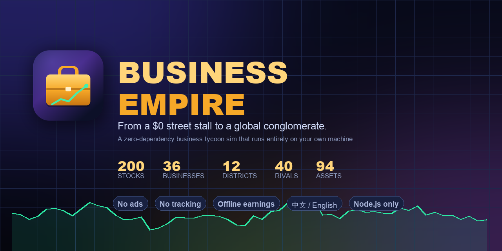

<p align="center">
  
</p>

<h1 align="center">Business Empire</h1>

<p align="center">
  <b>Start with $0. End owning the companies on the world rich list.</b><br>
  A deep, offline-first business tycoon simulation that runs entirely in your browser — with zero dependencies.
</p>

<p align="center">
  
  
  
  
  
</p>

<p align="center"><a href="README.zh-CN.md">🇨🇳 中文说明</a></p>

---

## The pitch

You wake up with **nothing**. no savings, no company, no car — just a job handing out flyers for $18 an hour.

Eight in-game hours a day you work your shift. After 17:00 you can pick up overtime — but each
overtime hour genuinely *takes an hour*: the money only lands once it has elapsed, you cannot start
a second one until the first is done, and it burns stamina you only get back by sleeping. A day is
still 24 hours and you are still a person.

You start with **nothing at all** — $0. Your first fifty dollars buy a street stall, and the stall
keeps earning while you're asleep. The stall buys a pancake cart. The cart buys a bubble tea shop.

Somewhere around your fourth store you stop caring about your salary. You start caring about
**where the money is parked** — 200 listed companies whose prices move on a six-factor stochastic
model, twelve commercial districts whose prosperity literally multiplies your stores' revenue,
ten regional housing markets you can mortgage into, and 23 cryptocurrencies that will happily
ruin your week.

And then, one day, you own enough of a company to make a **tender offer** for the rest of it —
and the billionaire who founded it drops down the rich list, because his fortune was never
abstract: it was that share price, and you just bought it.

---

## What makes it interesting

|  | |
|---|---|
| **📈 A market that behaves like a market** | Prices are not random walks with a cap. Each hourly log-return is the sum of a market factor scaled by β, a slow-rotating sector momentum, idiosyncratic noise, mean reversion toward a growing intrinsic value, GARCH-style volatility clustering, and Poisson jumps with news shocks. Bubbles inflate and deflate. Sectors rotate. Calm periods and panics both emerge on their own. |
| **🌍 A macro economy that moves everything** | Seven regimes — Boom, Expansion, Steady, Inflation, Slowdown, Recession, Crisis — re-rolled every in-game month. The regime moves equity drift, volatility, the **central bank policy rate** (which sets your savings, loan and mortgage rates), and the footfall at every store you own. Ten world events can rewrite the board outright. |
| **⏳ Labour that respects the clock and your body** | The day splits into sleep (23:00–07:00), an eight-hour shift (09:00–17:00) and free hours. Overtime occupies a real in-game hour and pays on completion — no click-spamming. Night shifts pay a 2.2× premium and cost double the stamina. Stamina drains as you work and recovers only in sleep; below 60 your output degrades, below 15 you cannot work overtime at all. Four overtime hours a day is sustainable, six burns you out. Wage income is capped by both time and biology; businesses are the only thing that scales. |
| **🕯️ Rumours that turn out to be true** | The market page carries oblique signals — *"Ro-ro berths at the port are booked three months out"*, *"Dealer inventory turns quietly stretched from 18 days to 41"* — tagged with a sector but never a direction. Behind each is a scheduled catalyst that really moves that sector 5–18% a day or two later, with intrinsic value re-rated so it holds. Seven in ten come true, two come to nothing, one is planted and moves against you. Over 28 in-game months and 113 rumours, reading them correctly returned **+4.3% with a 67% hit rate** against −0.3% for random. |
| **🌏 Open a shop in any of 7,330 cities** | Local economics follow from the country's World Bank income group times a city-size premium, and from population plus a world-city premium — your hometown is the 1.00 baseline. **Rent rises faster than revenue**: Tokyo does 2.06× Adelaide's revenue on 3.62× the rent, so a stall there nets $511/day against $261 but costs $43.7K to build against $16K and pays back in 86 days against 61. Big cities buy absolute profit with a worse return on capital; mid-cost countries pay back fastest but earn least. Opening abroad costs real airfare and days you cannot work. |
| **🏢 Found a company, and watch it get a price** | Put your shops into a company and it acquires a **valuation** — a multiple of annual profit, set by growth (+8× per 100% of annual growth), sector heat and scale, from 6× to 45×. Whichever is highest of earnings, revenue (only for the not-yet-profitable growing above 50%) and liquidation value. Company earnings land in the company account: spend them on more shops and the valuation compounds; pay them out as a dividend and lose 20% to tax. Raise angel, A, B and C rounds — investors always price you below your own number and take a slice each time. With two rounds raised, $5M of valuation, twelve businesses and real profit you can **take it public**: a quarter is floated, and your company becomes a **real tradable stock** on the market page, its price mean-reverting to its own earnings. Your stake turns into an ordinary position you can sell down or buy back. |
| **🍚 A cost of living that never stops** | You eat every day, pay rent every month, and pay a fare every time you leave the house. Eight meal tiers from skipping them to a private chef — including **cooking for yourself**, which is cheaper *and* healthier than eating out and costs 1.2–1.7 hours a day taken straight out of your overtime. Three housing tiers, and owning a home ends the rent. With no car you walk (free, 1.4h a day) or take the bus ($6/day); once you own one, fuel, parking and insurance run $13 a day. On a starting wage, cooking plus a shared room plus walking is **$700 a month — 42% of your base pay**. Eat badly and stamina drains, stress climbs and illness becomes twice as likely; fail to cover food at all and you go hungry. Three lotteries carry real odds (1 in 139,838,160 for the mega jackpot) and real expected returns of 46–57%, sitting there so you can watch the arithmetic yourself. |
| **🗺️ A world map with a life's footprint** | Drop a pin at the start to choose where you were born — 24 cities across seven continents — and every airfare and flight time thereafter is computed from the real great-circle distance to it. London to Paris is 343 km and $100; London to Adelaide is 16,265 km and $1,900. Forty-one destinations, each trip configured by nights, cabin and accommodation, priced as airfare plus lodging plus daily spending. You cannot work at all while away. Everywhere you go is recorded — first arrival, return visits, nights and money spent. The map is real geography — Natural Earth, 241 countries and **7,330 real cities** with their true populations and Chinese names — and **every one of them can be visited**, priced from real great-circle distance and from the country's World Bank income group times a city-size premium. Zoom in and smaller cities surface one at a time. |
| **⏱️ Adjustable world speed** | Five steps from 5 real minutes per in-game hour down to 12 seconds, a 25× range, re-anchored on the current moment so the clock never jumps. |
| **🧠 Debt that costs more than interest** | Leverage over 35%, or repayments eating a third of your income, steadily raise your **stress**. Past 50 it degrades output, past 78 you cannot face overtime, and past 55 every hour risks illness — five of them, from a bad cold to a cardiac scare. Illness stops you working; a doctor halves the recovery, or you tough it out while stress climbs. **Travel** is the cure: seven itineraries from a $600 weekend to a $6M suborbital flight, in economy, business or first — free of airfare if you own a jet. |
| **💰 Costs broken out like a real business** | Cost of goods at 42% of takings, wages around 22% (one employee generates ~4.5× their own wage, headcount derived from revenue), and rent charged monthly against the fit-out whether the doors are open or not. Net margin settles at 26–30% and payback runs 38 in-game days for a stall to 330 for heavy industry. Bigger cities take more but rent rises faster than revenue — the same tea shop pays back in 82 days in a small town and 213 in Dubai. Opening in another city means flying there: airfare plus days on the ground when you cannot work. |
| **🏬 Businesses with real operating decisions** | Six levers per store: location, **pricing strategy** (discount builds long-run traffic, premium harvests and churns customers), **staffing** (understaffing loses orders *and* customers), expansion, marketing, refurbishment, **opening hours** (the pancake cart trades 06:00–11:00 only, and rent burns while it is shut) and **managers** — each shop eats 0.8–4.7 hours of your day, and past eight you cannot hold a job at all. Get it wrong and you watch demand bleed out over the next in-game month. |
| **🏛️ Ownership that has consequences** | Every company has a tradable-stake cap. Max it out and you can tender for the rest at a 20–65% premium. A wholly-owned subsidiary remits its profit to you monthly — and if it's loss-making, you cover the losses. |
| **👋 Offline earnings, properly accounted** | Close the tab for three days and come back to a **Welcome Back** report: how long you were gone in real *and* in-game time, what your net worth did, exactly which sources the money came from, where it went, and how much of the change was valuation rather than cash. The numbers reconcile to the cent. |
| **🔒 Yours, entirely** | One `node server.js`. No npm install, no CDN, no telemetry, no ads, no account on anyone's server. The whole save is a single SQLite file you can copy. |

---

## Quick start

**Requirements:** Node.js **v22.5+** (v24 LTS or newer recommended). Nothing else.

```bash
git clone https://github.com/billzhao1030/Business_Empire.git
cd Business_Empire
node server.js
```

Open **http://localhost:8020** and register an account. That's it.

<details>
<summary><b>macOS — one-click desktop app</b></summary>

```bash
./tools/make-desktop-icon.sh
```

Builds a signed `.app` on your Desktop with a generated icon. Double-clicking it starts the server
if it isn't running (~0.7 s) and opens the browser; if it's already running it just opens the page
(~0.07 s). Logs go to `~/Library/Logs/BusinessEmpire.log`.
</details>

<details>
<summary><b>Windows</b></summary>

```powershell
winget install OpenJS.NodeJS.LTS   # once
node server.js
```

Or double-click **`start.bat`** (keeps a console window) or **`Business Empire.vbs`**
(silent background start — right-click → *Send to* → *Desktop shortcut* for an icon that behaves
exactly like the macOS app).

On Node v22/v23 use `node --experimental-sqlite server.js`.
</details>

<details>
<summary><b>Configuration</b></summary>

| Variable | Default | Meaning |
|---|---|---|
| `PORT` | `8020` | HTTP port |
| `GAME_HOUR_MS` | `60000` | Real milliseconds per in-game hour. Changing it never corrupts a save — the clock re-anchors. |

Save file: `data/game.db`. Delete `data/game.db*` to wipe everything, or use the in-game
**About → Reset save / Delete account**.
</details>

---

## How it plays

**Time:** 1 real minute = 1 in-game hour. A game day is 24 minutes, a game month 12 real hours,
a game year 6 days. **Everything accrues while you're away** — stores trade, interest compounds,
loan payments are debited, prices move, property indices drift.

**New saves are pre-seeded with 30 in-game days of price history**, so every chart, candle and
sparkline is meaningful from the first second.

### The ladder

```
$0  →  wages & overtime  →  $50 street stall  →  $900 scooter (unlocks driving jobs, $8→$28/hr)
    →  a portfolio of stores  →  equities & district units  →  leverage & mortgaged property
    →  50% of a company  →  100% of a company  →  the top of the rich list
```

### Systems at a glance

- **12 jobs** ($8 → $900 per work-hour, set at realistic rates). Regular shift 09:00–17:00, up to 6 overtime hours at 1.6× pay (2.2× at night), gated by a stamina system. The in-game clock and your current day-phase are pinned to the top of the interface at all times.
- **36 business formats** from a $50 street stall to a $5 B commercial spaceport, across 6 cities.
- **243 tradable instruments**: 200 stocks in 54 sectors, 12 commercial districts, 8 commodities, 23 cryptocurrencies — plus 14 non-tradable indices (broad market, 10 regional housing markets, watches, fine art, classic cars).
- **114 purchasable assets**: 21 cars (a car unlocks the driving jobs), 73 properties across 10 regions from a $32k studio upward with independent live housing indices, yachts, jets, watches, fine art. Prestige from luxury lifts revenue at *every* store, up to +60%.
- **A bank** whose rates float off the policy rate, with a 300–850 credit score, term deposits, unsecured credit, mortgages (20–100% down, 5/10/20/30 years) and punitive overdraft.
- **Taxes**: 25% corporate (monthly), 20% capital gains, 10% dividend withholding, 0.08% monthly property tax, 0.1% commission and a 0.04% spread on every trade.
- **A 40-strong rich list** of fictionalised tycoons whose fortunes are computed live from in-game share prices — dilute them by buying their companies.

---

## Under the hood

Zero third-party packages. Node's built-ins do everything:

```
node:http     →  the server              node:sqlite  →  the entire persistence layer
node:crypto   →  scrypt password hashing node:zlib    →  the PNG encoder that draws the app icon
```

The front end is plain ES modules with no build step; every chart — line, candlestick, moving
averages, sparklines, donuts — is drawn by hand into a `<canvas>` in ~250 lines.

```
src/
  market.js          price engine, macro regimes, game clock, news generation
  sim.js             player economy: work, operations, interest, tax, events
  api.js             business logic
  catalog-assets.js  200 stocks · commodities · crypto · districts · indices
  catalog-content.js businesses · cities · regions · property · vehicles · jobs · rivals
public/js/
  chart.js           canvas charting            i18n.js   284 bilingual strings
  views/             10 screens
```

Simulation cost: ~437 ms to generate a fresh world with 30 days of history for 257 instruments;
a live tick for all of them takes well under a millisecond.

---

## Roadmap

- [ ] Native Android client reusing the same REST API and accounts
- [ ] Optional rewarded-ad boosts with a one-time permanent ad-free unlock
- [ ] Short selling and margin
- [ ] Limit and stop orders
- [ ] Competitor AI that opens stores against you in the same districts

---

## Credits

The world map is drawn from **[Natural Earth](https://www.naturalearthdata.com/)**, in the public
domain and free of any restriction on use:

- 1:50m Admin 0 country boundaries, bundled as TopoJSON via
  [world-atlas](https://github.com/topojson/world-atlas)
- 1:10m populated places and Admin 0 countries, reduced to
  `public/data/cities.json` by `tools/build-cities.mjs` — 7,330 cities and 245 countries and
  territories, with English and Chinese names, populations and income groups

Everything else — engine, art, text and data — is original to this project.

Nothing is fetched from the network while the game runs: the map, all 257 instruments and every
asset are served from your own machine.

---

## Legal

**Copyright © 2026 Xunyi Zhao ([@billzhao1030](https://github.com/billzhao1030)).**
Released under the [MIT License](LICENSE).

> **Parody disclaimer.** Every company, brand, product and person in this game is **fictional**.
> Names such as *Appel*, *MicroHard*, *Envidia*, *Teslo*, *Elon Tusk* or *Jeff Bezoz* are
> deliberate parodies created for satirical and entertainment purposes. They are **not**
> affiliated with, endorsed by, sponsored by or connected to any real company or individual, and
> any resemblance is intentional commentary rather than a claim of association. All financial
> figures, price series and events are synthetic.
>
> **Not financial advice.** This is a game. Nothing in it constitutes investment advice, and its
> market model — deliberately entertaining rather than accurate — should not be used to reason
> about real markets.
